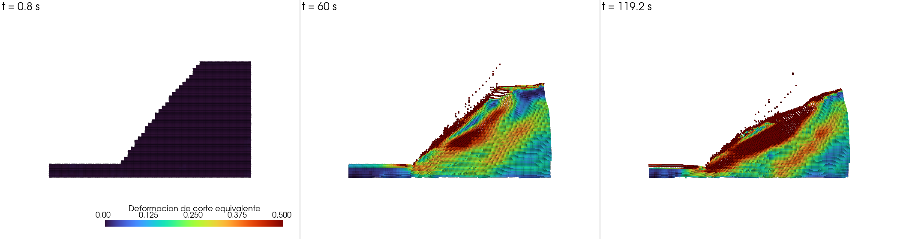
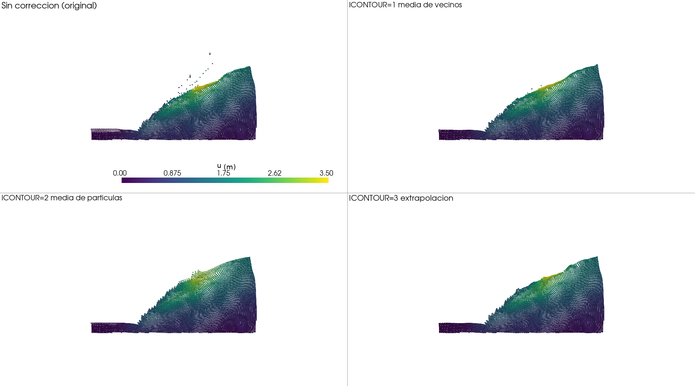

**English** · [Español](README.es.md)

# PIV-NP: Particle Image Velocimetry with numerical particles

PIV-NP computes **displacements, strains, velocities, accelerations, energies and water
content** of numerical particles that move with the velocity field measured by
[PIVlab](https://pivlab.blogspot.com/) on a sequence of images of a test (for example, a
slope in a geotechnical centrifuge). Unlike classic PIV, which reports velocities on a
fixed (Eulerian) grid, PIV-NP follows each material point (Lagrangian), which makes it
suitable for **large displacements** and accumulated strains.

> Pinyol, N.M. & Alvarado, M. (2017). *Novel analysis for large strains based on particle image velocimetry*.
> Canadian Geotechnical Journal 54(7): 933-944. doi:10.1139/cgj-2016-0327

Version 2.0 is written in Python and is about **19 times faster** than the original Fortran
version (`legacy/`): 38 s → 2 s for the centrifuge case.



> **New here?** Start with the [**getting-started guide**](docs/GUIDE.md). It takes you from
> a fresh clone to analysing your own test: install it, run the example that ships with the
> repository, check that the answer is right, turn the moisture measurement on, and then
> build your own case. This README is the reference you come back to afterwards.

```bash
pivnp examples/shear-block                             # from PIVlab files
pivnp examples/piv-from-images --source images         # from photographs, no PIVlab needed
```

Both ship with their data and both have an answer you can check.

---

## Contents

1. [Installation](#installation)
2. [Usage](#usage)
3. [Input files](#input-files)
4. [Results](#results)
5. [How it works](#how-it-works)
6. [Visualisation](#visualisation)
7. [Boundary correction](#boundary-correction)
8. [Performance](#performance)
9. [Tests](#tests)
10. [Project layout](#project-layout)

## Installation

With [conda](https://docs.conda.io/) (recommended):

```bash
conda env create -f environment.yml
```

```bash
conda activate pivnp
```

```bash
pip install -e .
```

With pip only (Python ≥ 3.10):

```bash
pip install -e .
```

The first run takes a few extra seconds while Numba compiles the computational kernels.
The compilation is cached, so later runs start immediately.

## Usage

### Command line

The case directory must contain `PIV-NP.TXT` (with the case name), `<case>.PAR` and the
files exported by PIVlab:

```bash
pivnp path/to/case
```

Options:

| Option | Description |
|---|---|
| `--case NAME` | case name (otherwise read from `PIV-NP.TXT`) |
| `--source NAME` | where the displacement data comes from (default `pivlab`); see [below](#other-sources-of-displacement) |
| `--threads N` | computation threads (default: all cores) |
| `--prefetch N` | steps read ahead (default 4) |
| `--contour-min-neighbors N` | with `ICONTOUR=1`: neighbours with data required (default 3) |
| `--contour-layers N` | with `ICONTOUR=1` and `3`: layers of points to rebuild (default 1) |
| `--contour-min-particles N` | with `ICONTOUR=2`: particles required around the point (default 1) |
| `--legacy-compat` | reproduce the behaviour of the Fortran version exactly |
| `--legacy-2023-average` | reproduce the staggered-grid average of the 2023 version (`IVERSION=2` only) |
| `--vtk` | also export to VTK for ParaView |
| `--write-moisture` | write the `Moist_<n>.TXT` from the test images and stop, without running the analysis |
| `--convert-par` | rewrite every `.PAR` below the directory in the single format and stop |
| `-q` | errors only |

`python -m pivnp path/to/case` works as well.

### From Python

```python
from pivnp import Simulation

sim = Simulation.from_directory("path/to/case")
summary = sim.run()

# Final state in memory, without reading files:
sim.particles.displacement   # (n, 2) accumulated displacement
sim.particles.eq_strain      # (n,)   equivalent shear strain
```

### Comparing results

```bash
python -m pivnp.compare reference.POST.RES new.POST.RES
```

Compares line by line and tolerates differences of one unit in the sixth digit.

### Other sources of displacement

The velocity field does not have to come from PIVlab. The analysis only ever sees one
`Frame` per step, so any origin can provide it. Two come with PIV-NP:

| `--source` | where the displacements come from |
|---|---|
| `pivlab` | the `datos (n).txt` files PIVlab exports (the default) |
| `images` | measured from the photographs by PIV-NP itself, no PIVlab needed |

```bash
pivnp examples/my-case --source images
```

`--source images` needs a [`<case>.PIV`](#input-files) file saying
where the photographs are and how many metres a pixel is worth. It is meant as a way in:
if you have photographs and no PIV experience you get a result, and you can decide later
whether to learn PIVlab. **It is not a replacement for PIVlab.** On the test it was checked
against it agrees to 8 % on displacement and 7 % on how much strain there is, but only
broadly on *where* the strain is — see [`docs/VALIDATION.md`](docs/VALIDATION.md#8-the-built-in-piv)
for the numbers and the limits.

Writing a new source is one class and one registration — the contract, with a worked
example, is in [`src/pivnp/sources.py`](src/pivnp/sources.py) and in
[`docs/ARCHITECTURE.md`](docs/ARCHITECTURE.md).

## Input files

### `PIV-NP.TXT`

A single line with the case name (no extension), for example `zapatak`.

### `<case>.PAR`

Fortran list-directed format: values are separated by spaces, tabs or commas. The comment
lines are required and carry the field names above their values, so the file explains
itself.

```
Analysis title
BLOCK 2: n_cells n_nodes n_part_cell n_rows width    height
         2006    2100    3           34     0.212115 0.212115
BLOCK 3: dt  total_steps print_every moisture mesh_version pivlab contour restart track
         0.8 149         1           0        1            1      0       0       0
BLOCK 4: s_density porosity
         2650.0    0.4
!------------------------------------------------------------------------------------------
! What every value means. Nothing below this line is read.
! ...
```

A legend follows block 4 explaining what each number means and which options each variable
takes. It is not read: it is there for whoever opens the file. The converter writes it, and
the easiest way to set up a new case is to copy another case's `.PAR` and change the values.

| Parameter | Meaning |
|---|---|
| `NC`, `NN` | cells and nodes (points) of the PIVlab grid; NN = (NC/NFIL + 1)(NFIL + 1) must hold |
| `NPC` | rows and columns of particles per cell (NPC² per cell), from 1 to 6 |
| `NFIL` | rows of cells |
| `AXC`, `AYC` | cell width and height [m] |
| `DT` | time between images [s] |
| `TOTAL_STEPS` | number of PIVlab files to process |
| `IMPPAS` | results are written at step 1 and every `IMPPAS` steps |
| `MOISTER` | 0 = no moisture; 1 = read it from `Moist_<n>.TXT`; 2 = compute it from the test images (`<case>.HUM`) |
| `IVERSION` | 1 = PIVlab velocities sit at the grid nodes; 2 = they sit at the centre of each element (grid shifted half a cell) |
| `IPIVLAB` | 1 = 4-column files (older PIVlab); any other value = 5 columns |
| `ICONTOUR` | boundary correction: 0 = none, 1 = neighbour average, 2 = particle average, 3 = extrapolation |
| `IREC` | 0 = new analysis; 1 = continue from `<case>.REC` |
| `ITR` | must be 0 |
| `S_DENSITY`, `POROSITY` | read but not yet used in the computation (particle mass is 1) |

Input is validated on reading: if something does not add up (for instance, NC not a
multiple of NFIL) you get an explicit message instead of meaningless results.

#### Cases from earlier versions

Block 3 changed order several times over the years, and there were even files with the same
values arranged differently. There is a single input format, so an old case is moved to it
once:

```bash
pivnp <directory> --convert-par
```

This rewrites every `.PAR` below the directory and keeps each original next to it as
`<case>.PAR.orig`. The conversion reorders the values as they are, without reformatting
them, so not one decimal changes; the two places where it does correct something —`IPIVLAB`,
from the number of columns the case files actually have, and the `MOISTER` of the versions
where 2 meant something else— are reported on screen.

### PIVlab data

* `datos (1).txt`, `datos (2).txt`, …: PIVlab ASCII export with 3 header lines and columns
  `x, y, u, v` (or 5 columns when `IPIVLAB ≠ 1`). Points without a measurement hold `NaN`.
* `Moist_1.TXT`, … (only with `MOISTER=1`): 1 header line and columns
  `x, y, water content, saturation`.

File names are case-insensitive.

#### Where they go

The inputs may sit **beside the `.PAR`** or be grouped in a **subfolder of the case**:

```
my-case/
├── PIV-NP.TXT  mycase.PAR  mycase.HUM  calibration.csv   configuration
├── mycase.POST.RES  .POST.MSH  .REC                      results
├── pivlab/     datos (1..n).txt
├── moisture/   Moist_1..n.TXT
└── images/     the test photographs (the path is set in the .HUM)
```

A 149-step test has 149 input files, which buries the handful of configuration files among
them. The case root is searched first, so a flat case — the layout of every case before
this — keeps working untouched. The same file in both places is an error, not a silent
choice. The photographs need no convention: their path is whatever the `IMAGES` key of the
`.HUM` says.

The original Fortran reads only the flat layout, so `tools/make_reference.py` flattens the
files before running it.

### `<case>.HUM` (only with `MOISTER=2`)

With `MOISTER=2` the moisture is measured from the test photographs instead of being read
from `Moist_<n>.TXT`. The settings go in a `<case>.HUM` file, where every value is named,
the order does not matter and `!` starts a comment:

```
! moisture measurement
IMAGES        = vis_{n}.jpg               ! {n} is replaced by the step number
CHANNEL       = gray                      ! 1 red, 2 green, 3 blue, 0 or "gray"
SIGMA         = 40                        ! averaging radius, in pixels
DRY_REFERENCE = ref2.jpg                  ! photo of the dry soil
CALIBRATION   = calibration_slope_rgb.csv ! gray,saturation,moisture of the soil
```

| Key | Default | Meaning |
|---|---|---|
| `IMAGES` | `vis_{n}.jpg` | name of the image of each step; it must contain `{n}` |
| `CHANNEL` | `gray` | channel used: `1` red, `2` green, `3` blue, `0`/`gray` grayscale |
| `SIGMA` | `40` | radius of the Gaussian blur applied to each image, in pixels |
| `DRY_REFERENCE` | `ref2.jpg` | photograph of the dry soil, the reference of each pixel |
| `DRY_OFFSET`, `SATURATED_OFFSET` | `5`, `-6` | gray levels above/below the reference that mark dry soil and saturated soil |
| `DRY_BAND`, `SATURATED_BAND` | — | the two intensities, fixed for the whole image, instead of the per-pixel reference. Both together or neither |
| `CALIBRATION` | — | **required**: CSV with the `gray,saturation,moisture` curve of the soil |
| `INCREMENTAL` | `0` | `1` = the soil can only get wetter: each pixel keeps the wettest value it reached |
| `SATURATION_THRESHOLD` | `0.95` | with `INCREMENTAL=1`, saturation above which a pixel is held at the saturated end |
| `FIRST_STEP` | `same` | `legacy` reproduces the MATLAB code, which gave the first step water content 0 and a constant saturation |
| `LEGACY_ROUNDING` | `0` | `1` rounds the blurred image to integers, as MATLAB did |
| `SCALE_X`, `OFFSET_X`, `SCALE_Y`, `OFFSET_Y` | `1, 0, 1, 0` | where the PIV grid falls on the moisture image |
| `SHEAR_XY`, `SHEAR_YX`, `PERSPECTIVE_X`, `PERSPECTIVE_Y` | `0` | the remaining terms of the projective transform, for a second camera (SWIR) looking from a different angle |

The calibration CSV has a header `gray,saturation,moisture` and one row per laboratory
measurement; the curve is interpolated between them exactly as MATLAB's `pchip` does.
Values outside the table are clamped to its ends and reported as such.

### `<case>.PIV` (only with `--source images`)

With `--source images` there are no PIVlab files: PIV-NP measures the displacements from the
photographs itself. It needs to be told where they are and how many metres a pixel is worth,
and that goes in a `<case>.PIV` file — same shape as the `.HUM`, every value named, order
irrelevant, `!` starts a comment:

```
! PIV from the photographs
IMAGES     = images/shot_{n:03d}.jpg   ! {n} is the image number; {n:03d} pads it to 001
SCALE      = 0.00054081                ! metres per pixel -- measure it, there is no default
WINDOW     = 16                        ! final interrogation window, in pixels
OVERLAP    = 0.5                       ! so the grid step is 8 px
PASSES     = 2                         ! 32 px to find the displacement, 16 to refine it
REGION     = 232, 213, 1656, 845       ! the part of the photograph with material in it
MASK_BELOW = 25                        ! darker than this is background, not soil
```

| Key | Default | Meaning |
|---|---|---|
| `IMAGES` | — | **required**: name of each photograph; must contain `{n}`, and `{n:03d}` pads it with zeros (`shot_001.jpg`) |
| `SCALE` | — | **required**: metres per pixel. This one number turns every displacement into metres, and there is no way to guess it — measure something of known length in a photograph, or take it from the calibration of the test |
| `CHANNEL` | `gray` | channel used: `1` red, `2` green, `3` blue, `0`/`gray` grayscale |
| `WINDOW` | `32` | side of the final interrogation window, in pixels; a power of two, 16 or 32 is usual. Smaller resolves more detail and measures less reliably |
| `OVERLAP` | `0.5` | how much neighbouring windows share, so the grid step is `WINDOW × (1 − OVERLAP)` |
| `PASSES` | `2` | each pass before the last uses a window twice as wide, to find a displacement it knows nothing about. A third pass buys very little |
| `FIRST_IMAGE` | `1` | number of the first photograph, for sequences that do not start at 1 |
| `REGION` | whole image | `left, top, right, bottom` in pixels: the part of the photograph the grid covers. Without it the grid spans everything, including background that will never move |
| `MASK_BELOW` | — | pixels darker than this are not material. For photographs whose background has been blacked out |
| `MASK_IMAGE` | — | an image marking the material instead, anything non-black being material. Use this *or* `MASK_BELOW`, not both |
| `OUTLIER_THRESHOLD` | `2.0` | how far a vector may differ from its neighbours, in their own spread, before it is rejected (the normalised median test) |
| `SMOOTH` | `0.6` | width, in grid points, of the smoothing of the finished field. The strain is a difference between neighbouring vectors, so the sub-pixel scatter that hardly shows in the displacement dominates it. `0` keeps the raw field |

The grid of interrogation windows **is** the PIV grid, so it has to be the grid `BLOCK 2` of
the `.PAR` describes. It is not left to chance: if the two disagree PIV-NP refuses to run and
prints the `BLOCK 2` line these photographs and settings would need, so you can paste it in.

What to expect of it is in [`docs/VALIDATION.md`](docs/VALIDATION.md#8-the-built-in-piv): on
the test it was checked against, displacements within 8 % of PIVlab and the amount of strain
within 7 %, but only broad agreement on where the strain is.

## Results

| File | Contents |
|---|---|
| `<case>.POST.MSH` | point mesh for GiD (one per particle), at their initial positions. Material 1 = active, 2 = no data at step 1 |
| `<case>.POST.RES` | per-particle results at every printed instant (GiD) |
| `<case>.REC` | final state, to continue the analysis with `IREC=1` |

Results in `.POST.RES`:

| Name | Type | Description |
|---|---|---|
| `Displacement` | vector | accumulated displacement |
| `Inst_displacement` | vector | displacement of the last step |
| `NaNs` | scalar | missing data around the particle: element nodes without a measurement (IVERSION=1) or central point without one (IVERSION=2) |
| `Velocity`, `Acceleration` | vector | particle velocity and acceleration |
| `Total_strain`, `Inc_strain` | 3 comp. | εxx, εyy, γxy accumulated / per step |
| `Equi_strain`, `In_E_strain` | scalar | equivalent shear strain, accumulated / per step |
| `Vol_strain`, `Ins_vol_strain` | scalar | volumetric strain, accumulated / per step |
| `Vorticity` | scalar | curl of the velocity field, ∂v/∂x − ∂u/∂y [s⁻¹], positive counter-clockwise |
| `Rotation` | scalar | rotation accumulated by the particle [degrees] |
| `Vorticity_num` | scalar | kinematic vorticity number: 0 pure shear, 1 simple shear, more = rotation dominates. `NaN` where undefined |
| `Rot_angle` | scalar | the same thing bounded: 0° pure shear, 45° simple shear, 90° rigid rotation |
| `Finite_strain` | 3 comp. | Green-Lagrange strain from the deformation gradient: εxx, εyy, γxy |
| `Fin_equi_strain` | scalar | its equivalent shear strain |
| `Finite_rotation` | scalar | rotation of the polar decomposition [degrees], exact for any angle |
| `Finite_area` | scalar | true change of area, `det(F) − 1` |
| `E_potential`, `E_kinetic`, `E_total` | scalar | energies per unit mass (`E_total` = potential + kinetic) |
| `Moisture`, `Saturation` | scalar | only with `MOISTER=1` |

Since the mesh holds the initial positions, `mesh + Displacement` is always the current
position of each particle.

`Vorticity` and `Rotation` are not written in `--legacy-compat` mode, because the original
Fortran had no such blocks and the regression suite compares the whole file against it.

### Two ways of measuring the same deformation

The `Total_strain` family adds a **linear increment at every step**, which is what the
original Fortran did. The `Finite_*` family differentiates **once** over the whole analysis,
from the deformation gradient `F = I + ∂u/∂X` of the accumulated displacement. Both are
published, because an analysis made with either should be comparable before the older one is
retired.

Where they differ, the finite one is right:

* a **rigid rotation** deforms nothing, and the Green-Lagrange strain is identically zero for
  it. The incremental one reports an equivalent shear of 0.005 and a 1.5 % loss of volume on
  the `rotation` test cases, which turn 50° without deforming.
* `Finite_rotation` is exact for an angle of any size; `Rotation` accumulates small-angle
  increments.
* `Finite_area` is `det(F) − 1`, the true change of area, not the trace of a linear increment.
* for a real deformation the two agree to the finite correction: simple shear with γ = 0.1
  gives an equivalent strain of 0.057735 incrementally and **0.057831** finitely, which is
  the exact closed-form value.

The cost is **4 more blocks in the `.POST.RES`, about 40 % more file**, and a few per cent of
run time. Neither family is written in `--legacy-compat` mode beyond what the Fortran wrote.

### Telling rotation apart from shear

A rigid rotation does not deform the material, but accumulating linear strain increments
reports strain for it: the `rotation` test cases turn 50° without deforming and still come
out with an equivalent shear strain of about 0.005. Looking at `Equi_strain` alone there is
no way to know whether a zone is really shearing or just turning.

`Vorticity` is what separates the two, and it costs almost nothing: shear and rotation are
the symmetric and the antisymmetric halves of the same velocity gradient, which the solver
already computes. On those same cases, with the boundary rebuilt, `Rotation` lands within
**0.01°** of the true 50° and is identical on every particle — so where the strain lies, the
rotation does not.

`Vorticity_num` puts the two on one scale, as the **kinematic vorticity number** used in
structural geology: 0 means the material deforms without turning, 1 is simple shear (a shear
band), and above that the rotation dominates. It is a ratio, so a rigid rotation makes it
infinite; that case is written as `NaN`, which is itself the answer. `Rot_angle` is its
arctangent, bounded between 0° and 90°, which is the one to colour a map by — `Vorticity_num
= tan(Rot_angle)` converts between them.

Both describe **the deformation accumulated so far**, which is how the number is estimated
from finite strain in deformed rocks. Neither means anything where the material barely
moved: there the ratio is noise over noise. Threshold by `Equi_strain` before reading them.

### Continuing an analysis

With `IREC=1` the analysis carries on from the previous `.REC`: time and step numbering
continue, and the new results are **appended** to the existing `.POST.RES`. The PIVlab
files of the continuation are numbered from 1 again. Splitting an analysis in two gives
exactly the same result as running it in one go.

## How it works

```
 images ──PIVlab──► velocities on a fixed grid ──PIV-NP──► trajectories and strains
                    (datos (n).txt)                        of material particles
```

**1. Grid and particles.** The PIVlab points form a rectangular grid of
(NC/NFIL + 1) × (NFIL + 1) nodes. NPC × NPC numerical particles are created in each cell,
either at the Gauss points (NPC from 4 to 6) or evenly spread (NPC 2 and 3). With
`IVERSION=2` the grid is shifted half a cell, so that each PIVlab point sits at the centre
of an element and shares its velocity among the 4 nodes of that element.

**2. Nodal velocities.** At each step *n*, `datos (n).txt` is read, the points are
reordered (PIVlab numbers them by columns and top-down; PIV-NP by rows and bottom-up) and
the sign of *v* is flipped (the image *y* axis points downwards).

**3. Interpolation to the particles.** Each particle is located in its cell and its local
coordinates (ξ, η) ∈ [−1, 1] are computed. With the bilinear shape functions

  Nᵢ(ξ, η) = ¼ (1 + ξ ξᵢ)(1 + η ηᵢ)

the code obtains the velocity **v**ₚ = Σ Nᵢ **v**ᵢ, the acceleration
**a**ₚ = Σ Nᵢ (**v**ᵢⁿ − **v**ᵢⁿ⁻¹) / Δt and the step displacement Δ**u**ₚ = **v**ₚ Δt.

**4. Strains.** Using the shape function derivatives at the element centre (strain is
uniform within each cell):

  Δεxx = Σ ∂Nᵢ/∂x · vx,ᵢ Δt  Δεyy = Σ ∂Nᵢ/∂y · vy,ᵢ Δt  Δγxy = Σ (∂Nᵢ/∂y · vx,ᵢ + ∂Nᵢ/∂x · vy,ᵢ) Δt

They are accumulated, and the volumetric strain εv = εxx + εyy and the equivalent shear
strain εq = ⅔ q are computed, with q = √(3 J₂) of the tensor
(εxx, εyy, εzz = 0, εxy = γxy/2).

**5. Update.** The particle moves to **x**ₚ + Δ**u**ₚ. If it leaves the grid it is no
longer computed. Particles in cells whose 4 nodes have no data at the first step are taken
to be outside the material (air, background) and are excluded from the results.

**6. Results.** All results are written at step 1 and every `IMPPAS` steps; the final state
is saved to `<case>.REC`.

## Visualisation

Recommended: [ParaView](https://www.paraview.org/download/), free and open source. PIV-NP
converts the results to VTK, its native format, including those of the Fortran version:

```bash
pivnp-vtk path/to/case/zapatak.POST.RES
```

Then, in ParaView: **File → Open → `zapatak_vtk/zapatak.pvd` → Apply**, colour by
`Equi_strain` and press **Play**. Full guide (in Spanish) in
[`docs/VISUALIZATION.md`](docs/VISUALIZATION.md).

## Boundary correction

At the edge of the material PIVlab reports no velocity (NaN) for the points whose
interrogation window falls partly outside. Those points enter the interpolation without a
measured value, so the particles at the boundary move less than they should and some end up
detaching from the material.

`ICONTOUR` selects how the velocity of those points is rebuilt:

| ICONTOUR | Method | Parameters |
|---|---|---|
| 0 | none | — |
| 1 | average of the neighbouring nodes with data (8 neighbours) | `--contour-min-neighbors`, `--contour-layers` |
| 2 | average velocity of the particles in the surrounding elements | `--contour-min-particles` |
| 3 | linear extrapolation from the interior outwards | `--contour-layers` |

With any method other than 0, the shifted grid also normalises how each point is shared
among the nodes of its cell, so boundary nodes get the average of the contributing points
instead of a fraction of it.

Rebuilt points are flagged separately and do **not** change the "no data" marks, so the
correction never activates particles in the air: it only improves the interpolated velocity
of the boundary particles.

Effect on the centrifuge case (149 steps, 9378 active particles):

| Configuration | Isolated particles at the end | Maximum displacement |
|---|---|---|
| No correction | 14 | 3.61 m |
| ICONTOUR=1, 3 neighbours, 1 layer | 0 | 3.67 m |
| ICONTOUR=2, particle average | 0 | 3.10 m |
| ICONTOUR=3, extrapolation | 0 | 3.39 m |

"Isolated particles" are those left without any neighbour within one cell, that is, those
that detached from the material.



Which one is best is a physical question rather than a programming one: it is worth
checking against PTV markers or photographs of the test. Adding another method only takes a
class with an `apply(ctx)` method in `pivnp/contour.py`.

## Performance

Centrifuge case (18 054 particles, 149 steps, 768 MB of results), on a 16-core processor:

| Version | Time | Speed-up |
|---|---|---|
| Fortran (gfortran -O2) | 38.0 s | 1× |
| Python, 1 thread | 3.1 s | 12× |
| Python, 4 threads | 2.3 s | 17× |
| Python, 16 threads | 2.0 s | 19× |

Excluding the first Numba compilation (about 6 s, once). To measure it on your machine:

```bash
python benchmarks/benchmark.py path/to/case --threads 1 4 0 --legacy legacy/pivnp_legacy.exe
```

Where the speed-up comes from is explained in
[`docs/ARCHITECTURE.md`](docs/ARCHITECTURE.md). The comparison uses the Fortran code built
with gfortran.

## Tests

```bash
pytest
```

* **Synthetic cases** (`tests/data/synthetic/`): velocity fields with a known solution
  (displacement without strain, uniform and varying horizontal strain, shear and rigid-body
  rotation). The computed strains are checked against the analytical ones, and the analyses
  the group ran at the time are reproduced.
* **Regression**: 7 scenarios also run with the Fortran version (both grids, NPC = 2, 3 and
  4, water content, 5-column format and restart). In `--legacy-compat` mode, `.POST.RES`,
  `.POST.MSH` and `.REC` are required to be **byte-for-byte identical**.
* **Behaviour**: properties checked against known solutions (constant acceleration, linear
  strain field, an analysis split in two being equivalent to a single run).
* **Unit**: each module is compared with a literal translation of the Fortran loops
  (`tests/legacy_reference.py`) or with cases whose solution is known.

Coverage (Numba kernels can only be measured with compilation disabled):

```bash
NUMBA_DISABLE_JIT=1 pytest --cov=pivnp
```

In PowerShell: `$env:NUMBA_DISABLE_JIT=1; pytest --cov=pivnp`. Current coverage: 96 %.

To regenerate the reference results with the Fortran version (requires gfortran):

```bash
python tools/make_reference.py --source "path/to/caso paper centrifuga"
```

Beyond the test suite, [`docs/VALIDATION.md`](docs/VALIDATION.md) records what was checked
against the real cases analysed with earlier versions: where this version reproduces them
exactly, which differences turned out to be regressions in the older code, how much each
moisture decision moves the result, and which limits of the method are still open.

## Project layout

```
piv-np/
├── src/pivnp/
│   ├── config.py          reading and validation of PIV-NP.TXT and .PAR
│   ├── par_migrate.py     conversion of old .PAR files to the single format
│   ├── sources.py         where the displacement data comes from (interchangeable)
│   ├── mesh.py            grids and particle location
│   ├── particles.py       particle generation
│   ├── state.py           particle and nodal arrays
│   ├── pivlab_io.py       reading of PIVlab and water content data
│   ├── nodal.py           nodal fields
│   ├── contour.py         boundary correction
│   ├── solver.py          motion and strains
│   ├── gid_writer.py      GiD output
│   ├── fortran_format.py  fast, exact I/E14.6 formatting
│   ├── restart.py         .REC file
│   ├── simulation.py      main loop
│   ├── compare.py         result comparison
│   ├── vtk_export.py      VTK export for ParaView
│   ├── moisture/          moisture from the test images (MOISTER=2)
│   └── cli.py             command line
├── tests/                 unit, behaviour and regression tests
├── legacy/                original Fortran code, unmodified
├── tools/                 generation of reference results
├── benchmarks/            performance measurement
├── examples/
│   ├── shear-block/      a runnable example from PIVlab files, data included
│   └── piv-from-images/  the same idea from photographs, with no PIVlab
└── docs/
    ├── GUIDE.md           getting started, step by step
    ├── ARCHITECTURE.md    design and improvement proposals
    ├── VALIDATION.md      how it was checked, and the known limits
    └── VISUALIZATION.md   ParaView guide
```

The code, its comments and the documents under `docs/` are written in English.
[`README.es.md`](README.es.md) is the Spanish translation of this file.

## License and citation

BSD 4-clause (see [`LICENSE`](LICENSE)). All advertising materials mentioning features or
use of this software must cite:

> Pinyol, N.M. & Alvarado, M. (2017). Novel analysis for large strains based on particle image velocimetry.
> Canadian Geotechnical Journal 54(7): 933-944. doi:10.1139/cgj-2016-0327
