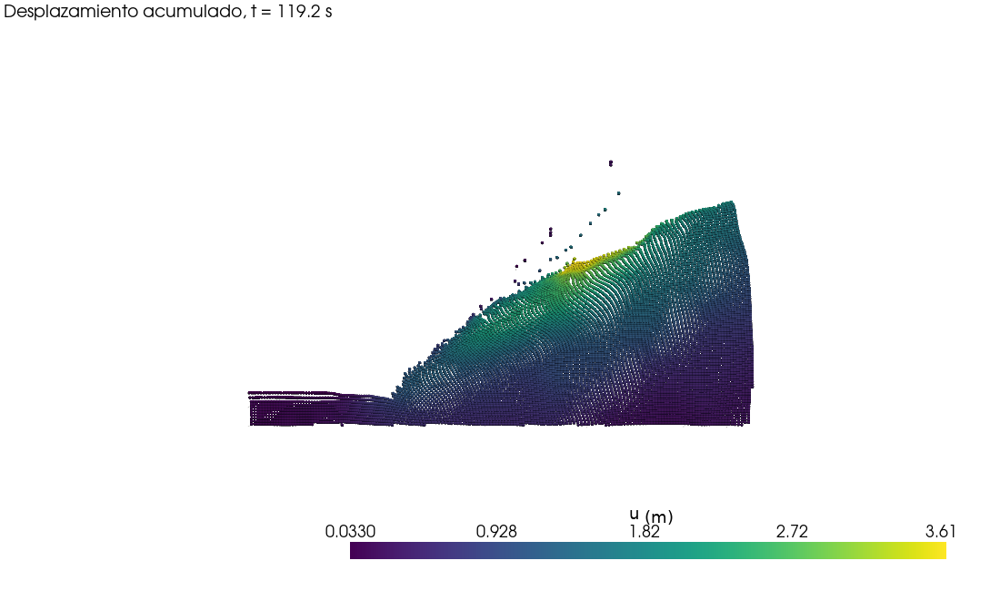

# Visualización de resultados con ParaView

[ParaView](https://www.paraview.org/download/) es gratuito, de código abierto (BSD) y
funciona en Windows, Linux y Mac. Es el estándar para posproceso científico y cubre lo que
se hacía con GiD: animación en el tiempo, colorear por cualquier resultado, flechas de
desplazamiento, cortes, gráficas sobre líneas y exportación de imágenes y vídeo.

ParaView no lee los `.POST.RES` de GiD, así que PIV-NP los convierte a VTK (su formato
nativo): un `.vtu` por instante y un `.pvd` que los agrupa como animación. Ocupa unas 6
veces menos (768 MB → 130 MB en el caso de la centrífuga) y los datos van en precisión
simple, igual que las 6 cifras del texto GiD.


## 1. Generar los archivos VTK

Al calcular:

```bash
pivnp ruta/al/caso --vtk
```

A partir de resultados ya existentes (también sirven los del ejecutable Fortran original):

```bash
pivnp-vtk ruta/al/caso/zapatak.POST.RES
```

Se crea la carpeta `zapatak_vtk/` con `zapatak.pvd`. Con `--every 5` se exporta uno de cada
5 instantes y con `-o carpeta` se elige dónde guardarlos.

## 2. Abrir en ParaView

1. **File → Open** → `zapatak.pvd` → **Apply**.
2. Pulsa el botón **2D** de la vista (o **Reset Camera** y mira desde −Z).
3. En **Representation**, elige **Points** (o **Point Gaussian** para puntos redondos) y
   ajusta **Point Size** a 3–5.
4. En el desplegable de color, elige el resultado: `Equi_strain`, `Displacement`
   (magnitud o componentes X/Y), `Vol_strain`…
5. **Play** (▶) en la barra superior para ver la animación. El tiempo es el de GiD
   (`Isochrones`).

Consejos:

* **Escala de color fija**: *Edit color map → Rescale to custom range* (por ejemplo, de 0 a
  0.5 para `Equi_strain`); si no, la escala cambia en cada instante.
* **Flechas de desplazamiento**: *Filters → Glyph*, Orientation = `Displacement`,
  Scale Array = `No scale array`, y *Masking → Every Nth Point* para no saturar.
* **Perfil a lo largo de una línea** (por ejemplo, desplazamiento en una vertical):
  *Filters → Plot Over Line*.
* **Evolución de una partícula en el tiempo**: selecciónala con *Select Points On* y
  aplica *Filters → Plot Selection Over Time*. El array `id` es el número de partícula de
  GiD.
* **Filtrar partículas**: *Filters → Threshold* sobre cualquier resultado.
* **Guardar la configuración** para reutilizarla con otros ensayos: *File → Save State*
  (`.pvsm`) y, al cargarla, *Search files under specified directory* con la nueva carpeta.
* **Vídeo**: *File → Save Animation* (`.avi`/`.ogv`) o una serie de `.png`.

## 3. Qué contiene cada archivo

Las coordenadas son las posiciones **actuales** de las partículas en cada instante (no hace
falta *Warp By Vector*). Arrays por punto:

| Array | Componentes |
|---|---|
| `id`, `material` | número de partícula GiD y material (1 activa, 2 sin datos, 3 PTV) |
| `Displacement`, `Inst_displacement`, `Velocity`, `Acceleration` | vector (x, y, 0) |
| `Total_strain`, `Inc_strain` | xx, yy, xy (γxy ingenieril) |
| `Equi_strain`, `In_E_strain`, `Vol_strain`, `Ins_vol_strain` | escalar |
| `E_potential`, `E_total` | escalar |
| `E_kinetic` | x, y |
| `NaNs` | contador heredado (ver HALLAZGOS H-11) |
| `Moisture`, `Saturation` | escalar (solo con `MOISTER=1`) |

## 4. Desde Python (opcional)

Con el extra `viz` (`pip install -e ".[viz]"`) se pueden abrir los mismos archivos con
[PyVista](https://pyvista.org), que usa el mismo motor que ParaView:

```python
import pyvista as pv

reader = pv.get_reader("zapatak_vtk/zapatak.pvd")
reader.set_active_time_point(len(reader.time_values) - 1)
grid = reader.read()[0]
grid.plot(scalars="Equi_strain", clim=(0, 0.5), cmap="turbo", point_size=4,
          render_points_as_spheres=True, cpos="xy")
```



## Otras alternativas gratuitas

* **VisIt** (LLNL, BSD): parecido a ParaView, lee los mismos `.vtu`/`.pvd`.
* **GiD**: tiene una versión gratuita de evaluación con límite de tamaño de malla (según la
  versión y la licencia); los `.POST.RES` siguen siendo compatibles.
